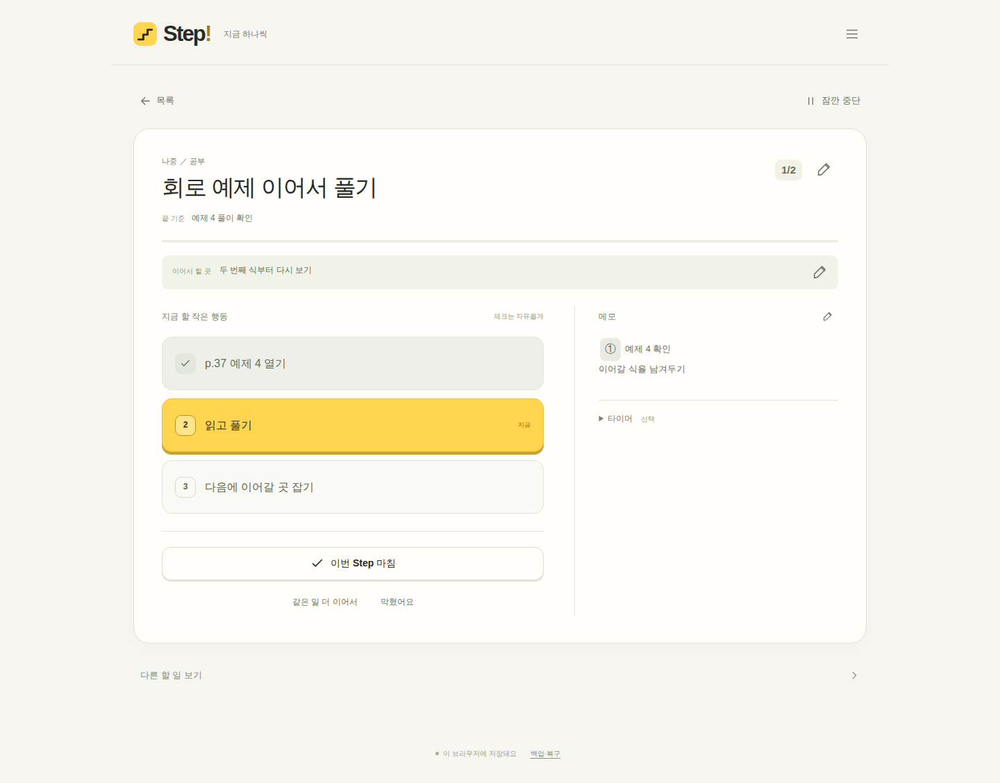

# Verification status — 2026-09-21

## Confirmed

- Archived original `08a1949b1d6c4636dd0d6ff4d18f66c6fc89fed7` and v0.6.60 main compared before implementation.
- 19 local model/data tests pass, including storage write failure, recovery failure, corrupt data, stale tabs, original storage isolation, import, drafts, progress and explicit completion.
- Syntax, module paths and manifest JSON checked.
- Mobile 390×844 and desktop 1440×1000 Chromium UI flows pass. [Verified run](https://github.com/tos-dori/step/actions/runs/35629977594).
- Browser flows: create → edit and recover draft after reload → move/collapse group → run → check/undo → memo token → pause/reload/resume → Step finish → separate final completion → keep/shelf/restore → delete group without losing tasks → legacy backup import → extend → blockage → export.
- Reviewed screenshots from both viewports. Fixed notification overlap with final controls, improved checked-action text to at least 4.5:1 contrast, removed zero-completed history clutter.
- Original production `main`, Pages site and user data are untouched.

## Pending

- New `tos-dori/step-local` repository creation. The connector provides repository content operations but no create-repository operation; GitHub's web creation screen timed out in the cloud browser.
- GitHub Pages activation and inspection at the final public URL.
- Actual user-device data has not been opened or modified. Backup migration tests use synthetic data.
- Direct tactile review is not equivalent to automated browser checks and screenshot inspection; no claim is made that the user has accepted the interaction feel.

## Screens from the verified build

[Mobile execution](docs/mobile-focus.png) · [Mobile completion](docs/mobile-completed.png)

